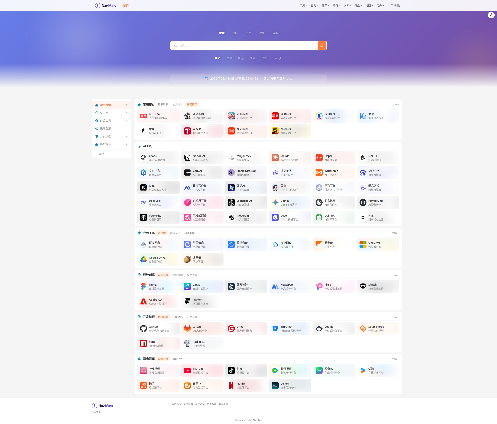

# NavMate

> Your web navigation companion.

**在线演示**：[https://hao.wccto.com](https://hao.wccto.com)



NavMate 是一个基于 Laravel 13 + Vue 3.5 的现代化网址导航系统，支持多主题、用户系统、后台管理、书签导入等功能。

## 技术栈

| 后端 | 前端 |
|------|------|
| PHP 8.4+ / Laravel 13.2 | Vue 3.5 + Vue Router 4 |
| Laravel Sanctum（API 认证） | Pinia 3（状态管理） |
| MySQL 5.7.22+ / 8.0+ | Tailwind CSS 4 |
| Redis（缓存/队列，可选） | Ant Design Vue（后台 UI） |
| Vite 8（构建工具） | DOMPurify（XSS 防护） |

## 功能特性

### 前台

- **分类导航** — 多级分类树，带图标展示
- **站内搜索** — 实时搜索 + 多引擎跳转（百度/Bing/Google/哔哩哔哩/淘宝等）
- **用户系统** — 注册、登录、邮箱验证、密码找回、头像上传
- **收藏夹** — 用户自定义收藏站点
- **快捷链接** — 用户自定义常用链接
- **布局设置** — 用户可调整站点布局偏好
- **主题切换** — 多主题支持（亮色/暗色）
- **响应式设计** — 移动端适配，侧边栏可折叠
- **SEO** — Sitemap、robots.txt、搜索引擎 Bot 预渲染
- **安装向导** — Web 端一键安装（环境检测、数据库配置）

### 后台管理

- **仪表盘** — 站点概览、统计数据
- **分类管理** — 增删改查、树形排序
- **站点管理** — 增删改查、URL 自动抓取标题/描述/图标
- **用户管理** — 用户列表、状态管理
- **数据分析** — 点击趋势、热门站点、时段分布
- **书签导入** — 支持 HTML/JSON 格式导入浏览器书签
- **友情链接** — 管理友情链接
- **广告管理** — 管理广告位（位置/排序/投放目标）
- **系统设置** — 站点名称、公告、SEO、邮件等配置
- **系统监控** — 服务器信息、缓存清理
- **在线更新** — 内置版本更新机制（传统部署可用）

## 目录结构

```
app/
├── Console/Commands/     # Artisan 命令（安装、迁移设置、更新）
├── Http/
│   ├── Controllers/
│   │   ├── Api/          # 用户 API（认证、分类、收藏、布局、链接）
│   │   └── Admin/        # 后台 API（分析、广告、书签导入、分类、仪表盘、友链、设置、站点、系统、用户）
│   └── Middleware/       # 中间件（管理员验证、安装检测、SEO预渲染、安全头、维护模式）
├── Models/               # Eloquent 模型（12个）
├── Providers/            # 服务提供者
└── Services/             # 业务服务（书签解析、分类树、安装器、系统信息、更新、URL抓取）

resources/
├── css/                  # Tailwind CSS
├── js/
│   ├── admin/            # 后台 Vue SPA
│   │   ├── components/   # AdminLayout.vue
│   │   ├── stores/       # adminAuth, adminCategories, adminDashboard, adminSites, adminUsers
│   │   ├── views/        # 11 个管理页面
│   │   └── router/       # 后台路由
│   ├── components/       # 前台组件（18个）
│   │   ├── auth/         # 认证弹窗（6个）
│   │   ├── AdBanner.vue          # 广告位
│   │   ├── ContentSection.vue
│   │   ├── PasswordStrength.vue  # 密码强度
│   │   ├── ProfileSection.vue    # 个人资料
│   │   ├── SearchBar.vue
│   │   ├── SiteCard.vue
│   │   ├── TheHeader.vue / TheSidebar.vue / TheFooter.vue
│   │   ├── ThemeSwitcher.vue
│   │   ├── ToastNotifications.vue
│   │   ├── UserQuickLinks.vue    # 快捷链接
│   │   └── ...
│   ├── composables/      # useSanitize, useSeo, useTheme
│   ├── stores/           # Pinia stores（9个）
│   ├── utils/            # lunar（农历）, request（HTTP）
│   ├── views/            # 页面组件（7个）
│   ├── router/           # 前台路由
│   └── App.vue           # 根组件
└── views/
    ├── spa.blade.php     # 前台 SPA 入口
    └── admin.blade.php   # 后台 SPA 入口

routes/
└── web.php               # 所有路由定义

database/
└── migrations/           # 21 个迁移文件
```

## 路由概览

### 公开页面
| 路径 | 说明 |
|------|------|
| `/` | 前台首页（SPA） |
| `/about` | 关于本站 |
| `/terms` | 使用条款 |
| `/sitemap.xml` | 站点地图 |
| `/robots.txt` | 搜索引擎指令 |

### 公开 API
| 路径 | 说明 |
|------|------|
| `GET /api/categories` | 分类列表 |
| `GET /api/settings` | 站点设置 |
| `GET /api/friend-links` | 友情链接 |
| `GET /api/ads` | 广告位 |
| `GET /api/search?q=` | 站内搜索 |
| `POST /api/fetch-url` | 抓取 URL 元数据 |
| `POST /api/click` | 点击记录 |

### 用户 API（需认证）
| 路径 | 说明 |
|------|------|
| `POST /api/register` | 注册 |
| `POST /api/login` | 登录 |
| `POST /api/logout` | 登出 |
| `POST /api/forgot-password` | 忘记密码 |
| `GET /api/user` | 当前用户 |
| `GET/POST /api/user/favorites` | 收藏管理 |
| `GET/PUT /api/user/layout` | 布局偏好 |
| `GET/POST /api/user/links` | 快捷链接 |
| `PUT /api/user/profile` | 更新资料 |
| `POST /api/user/avatar` | 上传头像 |

### 后台
| 路径 | 说明 |
|------|------|
| `/admin/login` | 管理员登录 |
| `/admin/api/dashboard` | 仪表盘数据 |
| `/admin/api/categories` | 分类 CRUD |
| `/admin/api/sites` | 站点 CRUD |
| `/admin/api/users` | 用户管理 |
| `/admin/api/analytics/*` | 数据分析 |
| `/admin/api/bookmarks/*` | 书签导入 |
| `/admin/api/settings` | 系统设置 |
| `/admin/api/friend-links` | 友情链接 |
| `/admin/api/ads` | 广告管理 |
| `/admin/api/system/*` | 系统操作 |

## 环境要求

| 项目 | 要求 |
|------|------|
| **PHP** | >= 8.4 |
| **必装扩展** | `pdo`, `pdo_mysql`, `mbstring`, `openssl`, `tokenizer`, `xml`, `curl`, `gd`, `fileinfo`, `zip` |
| **可选扩展** | `redis`（使用 Redis 缓存时需要） |
| **MySQL** | 5.7.22+ / 8.0+ |
| **Node.js** | >= 18（仅构建前端时需要，服务器可不装） |
| **Composer** | 2.x |
| **Web 服务器** | Nginx / Apache |
| **Redis** | 可选，用于缓存/队列 |

> **关于前端构建**：项目使用 Vite 8 构建，需要在有 Node.js 的环境执行 `npm install && npm run build`。如果服务器没有 Node.js，可以在本地构建后将 `public/build/` 目录上传到服务器。

---

## 安装向导

无论选择哪种部署方式，代码部署完成后都需要通过安装向导完成初始化配置。

### 如何进入安装向导

**方式一（自动跳转）**：部署完成后，浏览器访问你的站点域名或 IP，系统检测到未安装会自动跳转到安装向导。

**方式二（手动访问）**：直接在浏览器输入 `https://your-domain.com/install`。

> 安装完成后，再次访问 `/install` 会显示「应用已安装」提示。如需重新安装，需删除服务器上的 `storage/app/installed` 文件。

### 安装流程（共 6 步）

#### 步骤 1：环境检测

自动检测服务器环境，包括：
- **PHP 版本**（要求 >= 8.4）
- **必装扩展**：`pdo`, `pdo_mysql`, `mbstring`, `openssl`, `tokenizer`, `xml`, `curl`, `gd`, `fileinfo`
- **可选扩展**：`redis`, `memcached`
- **目录权限**：`storage/` 和 `bootstrap/cache/` 是否可写

所有必检项通过后「下一步」按钮才可点击。如果有红色项，需要在服务器上安装对应扩展或修复目录权限后再刷新页面。

#### 步骤 2：数据库配置

填写 MySQL 连接信息：

| 字段 | 说明 | 示例 |
|------|------|------|
| 数据库主机 | MySQL 地址 | 传统部署：`127.0.0.1`；Docker/1Panel：MySQL 容器名，如 `1Panel-mysql-vMFs` |
| 数据库端口 | MySQL 端口 | `3306` |
| 数据库名 | 数据库名称 | `navmate`（如不存在会自动创建） |
| 数据库用户 | 有权限的 MySQL 用户 | `navmate` |
| 数据库密码 | 用户密码 |  |

填写后点击「**测试连接**」，显示「数据库连接成功」即可进入下一步。

> 如果提示已有数据（如重新安装），会显示现有数据统计，确认后会覆盖。

#### 步骤 3：缓存配置

选择缓存驱动，点击对应选项即可：

- **Database**（推荐）— 无需额外服务，适合大多数场景
- **Redis** — 性能更好，但需要安装 Redis 服务和 PHP Redis 扩展。选择后会出现 Redis 连接配置项（主机、端口、密码），点击「测试连接」验证
- **File** — 最简单，但不适合生产环境

> 如果选择 Redis 但未安装 Redis 服务，安装会失败。不确定就选 **Database**。

#### 步骤 4：站点与管理员

| 字段 | 说明 |
|------|------|
| 站点名称 | 导航站名称，显示在浏览器标题栏和首页 |
| 站点 URL | 完整 URL，如 `https://nav.example.com`（影响 SEO 和链接生成） |
| 管理员用户名 | 后台登录用户名 |
| 管理员邮箱 | 后台登录邮箱 |
| 管理员密码 | 至少 8 位 |
| 确认密码 | 再次输入密码 |
| 导入示例数据 | 勾选后会自动创建示例分类和站点（方便体验，后续可删除） |

> 站点 URL 务必填写正确，包含 `https://` 或 `http://` 前缀。

#### 步骤 5：邮件配置（可选）

配置 SMTP 邮件服务，用于用户注册验证、密码找回等功能。

- 点击「跳过，稍后配置」可跳过此步，后续在后台「系统设置」中配置
- 内置常见邮件预设（QQ 邮箱、163 邮箱、Gmail、Outlook 等），选择预设后自动填入服务器地址和端口，只需补充账号和密码

> QQ 邮箱和 163 邮箱的密码不是登录密码，需要在邮箱设置中开启 SMTP 服务并获取授权码。

#### 步骤 6：执行安装

点击「**开始安装**」按钮，页面显示安装进度：

```
✓ 写入配置文件
✓ 生成应用密钥
✓ 配置数据库连接
✓ 执行数据库迁移
✓ 创建管理员账号
✓ 保存站点设置
✓ 安装完成
```

安装成功后页面显示成功提示，点击「**前往后台**」自动跳转到 `/admin/login`，使用步骤 4 设置的管理员账号登录。

> 安装完成后系统会创建 `storage/app/installed` 标记文件，后续访问不再显示安装向导。
> **安装完成后无需运行任何命令**，数据库迁移、配置写入等已全部自动完成。

### 安装后首次登录

1. 访问 `https://your-domain.com/admin/login`
2. 输入步骤 4 设置的邮箱和密码
3. 登录成功后进入后台仪表盘
4. 建议先到「分类管理」创建分类，再到「站点管理」添加站点

---

## 部署方式一：Docker Compose

适合快速部署，无需手动安装 PHP/MySQL/Nginx。

> **注意**：目前项目没有预构建的 Docker 镜像，需要自行构建。以下提供完整方案。

### 1. 创建项目目录

```bash
mkdir -p /opt/navmate && cd /opt/navmate
```

### 2. 创建 `docker-compose.yml`

```yaml
version: '3.8'
services:
  app:
    build:
      context: .
      dockerfile: Dockerfile
    ports:
      - "8080:80"
    environment:
      APP_ENV: production
      APP_DEBUG: "false"
      APP_URL: https://nav.example.com
      DB_HOST: mysql
      DB_PORT: 3306
      DB_DATABASE: navmate
      DB_USERNAME: navmate
      DB_PASSWORD: "your-strong-password"
      CACHE_STORE: database
      SESSION_DRIVER: database
      QUEUE_CONNECTION: database
    volumes:
      - app_storage:/var/www/html/storage
      - app_public:/var/www/html/public/uploads
    depends_on:
      mysql:
        condition: service_healthy
    restart: unless-stopped

  mysql:
    image: mysql:8.0
    environment:
      MYSQL_ROOT_PASSWORD: "root-password"
      MYSQL_DATABASE: navmate
      MYSQL_USER: navmate
      MYSQL_PASSWORD: "your-strong-password"
    volumes:
      - mysql_data:/var/lib/mysql
    healthcheck:
      test: ["CMD", "mysqladmin", "ping", "-h", "localhost"]
      interval: 5s
      retries: 5
    restart: unless-stopped

volumes:
  app_storage:
  app_public:
  mysql_data:
```

### 3. 创建 `Dockerfile`

```dockerfile
FROM composer:2 AS builder
WORKDIR /app
COPY composer.json composer.lock ./
RUN composer install --no-dev --optimize-autoloader --no-interaction

FROM node:20-alpine AS frontend
WORKDIR /app
COPY package.json package-lock.json ./
RUN npm ci
COPY . .
RUN npm run build

FROM php:8.4-apache
WORKDIR /var/www/html

# Install PHP extensions
RUN apt-get update && apt-get install -y \
    libpng-dev libjpeg-dev libfreetype6-dev libzip-dev libonig-dev libxml2-dev \
    && docker-php-ext-configure gd --with-freetype --with-jpeg \
    && docker-php-ext-install pdo_mysql mbstring xml curl gd zip fileinfo bcmath \
    && apt-get clean

# Enable Apache rewrite module
RUN a2enmod rewrite

# Copy application files
COPY . .
COPY --from=builder /app/vendor ./vendor
COPY --from=frontend /app/public/build ./public/build

# Set permissions
RUN chown -R www-data:www-data storage bootstrap/cache public/uploads \
    && chmod -R 755 storage bootstrap/cache

# Configure Apache document root
ENV APACHE_DOCUMENT_ROOT /var/www/html/public
RUN sed -ri -e 's!/var/www/html!${APACHE_DOCUMENT_ROOT}!g' /etc/apache2/sites-available/*.conf
RUN sed -ri -e 's!/var/www/!${APACHE_DOCUMENT_ROOT}!g' /etc/apache2/apache2.conf /etc/apache2/conf-available/*.conf

# Setup entrypoint
COPY --chmod=755 <<'EOF' /usr/local/bin/entrypoint.sh
#!/bin/bash
if [ ! -f .env ]; then
    cp .env.example .env
    php artisan key:generate --force
fi
# Only cache config if already installed (install wizard writes .env and needs fresh config)
if [ -f storage/app/installed ]; then
    php artisan config:cache
fi
apache2-foreground
EOF

ENTRYPOINT ["/usr/local/bin/entrypoint.sh"]
EXPOSE 80
```

### 4. 克隆代码并构建

```bash
cd /opt/navmate
git clone https://github.com/webrong/NavMate.git .
docker compose build
docker compose up -d
```

### 5. 初始化

访问 `http://your-ip:8080`，按安装向导完成配置。

- 数据库主机填写：`mysql`（Docker 服务名）
- 数据库名填写：`navmate`（docker-compose.yml 中 MYSQL_DATABASE 已自动创建）
- 缓存驱动选择：**Database**

### 6. 升级

```bash
cd /opt/navmate
git pull
docker compose build
docker compose up -d
```

> Docker 部署不支持后台在线升级，需要通过重新构建镜像方式更新。

---

## 部署方式二：传统 PHP 部署

适合 VPS / 独立服务器，支持后台在线升级。

### 1. 安装系统依赖

```bash
# Ubuntu/Debian
sudo apt update
sudo apt install -y php8.4 php8.4-fpm php8.4-mysql php8.4-mbstring php8.4-xml \
  php8.4-curl php8.4-zip php8.4-fileinfo php8.4-gd php8.4-bcmath \
  nginx mysql-server

# CentOS/RHEL (Remi 仓库)
sudo dnf install -y php84 php84-php-fpm php84-php-mysqlnd php84-php-mbstring \
  php84-php-xml php84-php-curl php84-php-zip php84-php-gd php84-php-bcmath \
  nginx mysql-server
```

### 2. 克隆项目

```bash
cd /var/www
git clone https://github.com/webrong/NavMate.git navmate
cd navmate
```

### 3. 安装依赖

```bash
# PHP 依赖
composer install --no-dev --optimize-autoloader

# 前端构建（需要 Node.js >= 18）
npm install
npm run build
```

> 如果服务器没有 Node.js，在本地电脑执行 `npm install && npm run build`，然后将 `public/build/` 目录上传到服务器。

### 4. 创建数据库

```bash
# 登录 MySQL
sudo mysql

# 创建数据库和用户
CREATE DATABASE navmate CHARACTER SET utf8mb4 COLLATE utf8mb4_unicode_ci;
CREATE USER 'navmate'@'localhost' IDENTIFIED BY 'your-strong-password';
GRANT ALL PRIVILEGES ON navmate.* TO 'navmate'@'localhost';
FLUSH PRIVILEGES;
EXIT;
```

> 也可以跳过此步，安装向导会自动创建数据库（需 MySQL 用户有 CREATE DATABASE 权限）。

### 5. 初始化

```bash
cp .env.example .env
php artisan key:generate
```

> 数据库、Redis、邮件等配置无需手动编辑 `.env`，首次访问时会进入安装向导，在网页上填写即可。
> **不要运行 `php artisan migrate`**，安装向导会自动执行数据库迁移。

### 6. 设置权限

```bash
chown -R www-data:www-data /var/www/navmate
chmod -R 755 storage bootstrap/cache public/uploads
```

### 7. 配置 Nginx

创建 `/etc/nginx/sites-available/navmate`：

```nginx
server {
    listen 80;
    server_name nav.example.com;
    root /var/www/navmate/public;

    add_header X-Frame-Options "SAMEORIGIN" always;
    add_header X-Content-Type-Options "nosniff" always;

    index index.php;
    charset utf-8;

    location / {
        try_files $uri $uri/ /index.php?$query_string;
    }

    location ~ \.php$ {
        fastcgi_pass unix:/run/php/php8.4-fpm.sock;
        fastcgi_param SCRIPT_FILENAME $realpath_root$fastcgi_script_name;
        include fastcgi_params;
    }

    location ~ /\.(?!well-known) {
        deny all;
    }
}
```

```bash
sudo ln -s /etc/nginx/sites-available/navmate /etc/nginx/sites-enabled/
sudo nginx -t && sudo systemctl reload nginx
```

### 8. 配置 HTTPS（推荐）

```bash
# 安装 certbot
sudo apt install -y certbot python3-certbot-nginx

# 获取并自动配置 SSL 证书
sudo certbot --nginx -d nav.example.com

# 自动续期（certbot 会自动添加定时任务）
sudo certbot renew --dry-run
```

配置完成后 Nginx 会自动将 HTTP 重定向到 HTTPS。

### 9. 配置定时任务

Laravel 调度器需要系统 Cron 支持：

```bash
# 编辑 www-data 用户的 crontab
sudo crontab -e -u www-data

# 添加以下行（每分钟执行一次调度器）
* * * * * cd /var/www/navmate && php artisan schedule:run >> /dev/null 2>&1
```

定时任务包括：点击日志自动清理（90天前）、数据统计等。

### 10. 完成

访问 `https://nav.example.com` 进入安装向导，按提示完成。

### 在线升级

传统部署支持后台一键升级。在 `.env` 中配置更新源：

```env
UPDATE_GITHUB_REPO=webrong/NavMate
```

然后在后台「系统管理 → 系统升级」页面点击「检查更新」即可。

> 升级流程：自动备份 → 下载新版本 → 校验 → 解压替换 → 运行迁移 → 清理缓存。全程有日志记录，支持回滚。

---

## 部署方式三：宝塔面板

适合不熟悉命令行的用户。

### 1. 安装宝塔面板

```bash
# 官方安装脚本
curl -sSO https://raw.githubusercontent.com/zhucaidan/btpanel-v7.7.0/main/install/install_panel.sh && bash install_panel.sh
```

### 2. 在宝塔中安装软件

在「软件商店」中安装：
- **Nginx** 1.24+
- **PHP-8.4**
- **MySQL** 5.7 或 8.0

安装 PHP 后，点击 PHP 版本旁的「设置」→「安装扩展」，确保以下扩展全部启用：

| 必装扩展 | 说明 |
|---------|------|
| `fileinfo` | 文件类型检测 |
| `mbstring` | 多字节字符串 |
| `openssl` | 加密 |
| `pdo_mysql` | MySQL 驱动（**关键**） |
| `tokenizer` | PHP 解析 |
| `xml` | XML 处理 |
| `curl` | HTTP 请求 |
| `zip` | 压缩 |
| `gd` | 图片处理 |

> 如果列表中显示「已安装」则跳过，未安装的点击「安装」。

### 3. 创建网站

1. 「网站」→「添加站点」
   - 域名：`nav.example.com`
   - PHP 版本：**PHP-84**
   - 数据库：**MySQL**，创建一个数据库，记下名称和密码
   - 不要勾选「创建 FTP」

### 4. 部署代码

```bash
cd /www/wwwroot/nav.example.com

# 清空默认文件
rm -rf *

# 克隆项目
git clone https://github.com/webrong/NavMate.git .
```

### 5. 安装依赖

**方案 A：服务器有 Node.js（宝塔软件商店可安装 Node.js 版本管理器）**

```bash
composer install --no-dev --optimize-autoloader
npm install
npm run build
```

**方案 B：服务器没有 Node.js**

1. 在本地电脑克隆项目
2. 执行 `npm install && npm run build`
3. 将生成的 `public/build/` 目录上传到服务器的 `/www/wwwroot/nav.example.com/public/build/`

### 6. 配置环境

```bash
cp .env.example .env
php artisan key:generate
```

> 无需手动编辑数据库配置，安装向导会引导你填写。

### 7. 设置权限

在宝塔「文件」管理器中，右键 `/www/wwwroot/nav.example.com` 目录：
- 权限设为 **755**
- 所有者设为 **www**

或在终端执行：

```bash
chown -R www:www /www/wwwroot/nav.example.com
chmod -R 755 storage bootstrap/cache public/uploads
```

### 8. 配置 Nginx 伪静态

在宝塔「网站」→ 点击站点名 →「设置」→ 左侧菜单「伪静态」，粘贴：

```nginx
location / {
    try_files $uri $uri/ /index.php?$query_string;
}
```

保存即可。

### 9. 配置定时任务

宝塔「计划任务」→「添加任务」：
- 任务类型：**Shell 脚本**
- 任务名称：`NavMate 调度器`
- 执行周期：**N 分钟 1 分钟**
- 脚本内容：

```bash
cd /www/wwwroot/nav.example.com && php artisan schedule:run >> /dev/null 2>&1
```

### 10. 配置 SSL

宝塔「网站」→ 点击站点名 →「设置」→ 左侧菜单「SSL」：
- 选择「Let's Encrypt」
- 勾选域名
- 点击「申请」
- 开启「强制 HTTPS」

### 11. 完成

访问域名进入安装向导：
- 数据库主机：`127.0.0.1`
- 数据库名/用户/密码：第 3 步创建的数据库信息

---

## 部署方式四：1Panel（Docker 面板）

适合喜欢现代化面板的用户。1Panel 使用 Docker 容器管理运行环境，以下为完整部署流程。

### 1. 安装 1Panel

```bash
curl -sSL https://resource.fit2cloud.com/1panel/package/quick_start.sh -o quick_start.sh && bash quick_start.sh
```

### 2. 安装运行环境

在 1Panel「应用商店」中安装：
- **OpenResty**（Web 服务器）
- **MySQL** 5.7+ 或 8.0

> MySQL 5.7.22+ 兼容本项目（JSON 列支持）。

### 3. 创建网站

「网站」→「创建网站」→ 选择「运行环境」：
- 主域名：`nav.example.com`
- 运行环境：**PHP 8.4**
- 根目录保持默认即可

> 1Panel 会自动创建 PHP 容器和 OpenResty 反向代理配置。

### 4. 安装 PHP 扩展

进入 1Panel「容器」→ 找到 PHP 容器（名称通常包含网站域名）→ 点击「终端」：

```bash
# 更新包源
apt update

# 安装必要的 PHP 扩展（以 PHP 8.4 为例，根据实际版本调整包名）
apt install -y php8.4-mysql php8.4-mbstring php8.4-xml php8.4-curl \
  php8.4-zip php8.4-fileinfo php8.4-gd php8.4-bcmath

# 验证扩展是否加载
php -m | grep -E 'pdo_mysql|mbstring|xml|curl|zip|fileinfo|gd'
```

> **必须包含 `pdo_mysql`**，否则安装向导检测不通过或数据库连接失败。

### 5. 部署代码

在 PHP 容器终端中操作：

```bash
# 进入网站根目录（注意：这是容器内路径，不是宿主机路径）
cd /www/sites/navmate/index

# 如果是空目录，克隆项目
git clone https://github.com/webrong/NavMate.git .

# 安装 PHP 依赖
composer install --no-dev --optimize-autoloader
```

> 如果容器内没有 Node.js，在本地执行 `npm install && npm run build`，然后将 `public/build/` 上传到容器内的 `/www/sites/navmate/index/public/build/`。

> **容器路径说明**：1Panel 容器内的网站路径通常是 `/www/sites/{网站名}/index`，而不是宿主机的 `/opt/1panel/...` 路径。所有 Artisan 命令都应在容器终端中执行。

### 6. 环境配置

继续在 PHP 容器终端中：

```bash
cp .env.example .env
php artisan key:generate
```

### 7. 设置权限

```bash
# 容器内执行
chmod -R 755 storage bootstrap/cache public/uploads
```

如果权限不对，也可在 1Panel「文件」管理器中右键网站目录设置权限为 **755**。

### 8. 配置伪静态

在 1Panel「网站」→ 点击站点名 →「网站设置」→ 找到「反向代理/伪静态」或「Nginx 配置」，确保包含：

```nginx
location / {
    try_files $uri $uri/ /index.php?$query_string;
}
```

### 9. 配置 SSL

在 1Panel「网站」→ 点击站点名 →「网站设置」→「HTTPS」：
- 选择「申请证书」（Let's Encrypt 或其他）
- 申请后开启「强制 HTTPS」

### 10. 完成安装

访问域名进入安装向导：

| 字段 | 填写说明 |
|------|---------|
| **数据库主机** | 填写 MySQL 容器名（在 1Panel「容器」列表中查看，类似 `1Panel-mysql-vMFs`）或 MySQL 容器的内网 IP。**不要填 `localhost` 或 `127.0.0.1`** |
| **数据库端口** | `3306` |
| **缓存驱动** | 如未安装 Redis，选择 **Database** |
| **Session 驱动** | 同上，选择 **Database** |

> 安装向导会自动检测环境、创建数据表和管理员账号。

### 11. 配置定时任务

1Panel「计划任务」→「创建计划任务」：
- 任务类型：**Shell 脚本**
- 任务名称：`NavMate 调度器`
- 执行周期：**每 1 分钟**
- 脚本内容：

```bash
docker exec navmate-php php /www/sites/navmate/index/artisan schedule:run >> /dev/null 2>&1
```

> 将 `navmate-php` 替换为你的 PHP 容器名。可在 1Panel「容器」列表中查看。

### 常见问题

**Q: 安装向导「下一步」按钮点击无效（页面刷新但不跳转）**
- 使用最新版本代码即可，此问题已在代码中修复。

**Q: 连接数据库失败 `Access denied`**
- 确认数据库用户有远程访问权限（1Panel MySQL 容器默认支持）。
- 数据库主机应填写 MySQL 容器名或内网 IP，不要填 `localhost`。

**Q: `Class "App\Services\PDO" not found`**
- 容器内未安装 `pdo_mysql` 扩展，参考第 4 步安装。

**Q: 1Panel 定时任务执行 Artisan 命令失败**
- 1Panel 任务执行器会自动在命令前加 `composer` 前缀，导致命令错误。
- 请直接在 PHP 容器终端中执行 Artisan 命令，或使用 `docker exec` 方式。

**Q: 页面出现 500 错误**
- 进入 PHP 容器终端执行 `php artisan config:clear` 清除配置缓存。
- 检查 `.env` 文件中的 `DB_DATABASE` 等配置是否正确。

**Q: 如何在 1Panel 中找到 MySQL 容器名？**
- 1Panel 面板 →「容器」→ 找到名称中包含 `mysql` 的容器，复制名称即可。

---

## 开发模式

```bash
# 同时启动 Laravel 和 Vite 开发服务器
composer run dev

# 或分别启动
php artisan serve
npm run dev
```

## 数据模型

```
User ─┬── Favorite ──── Site
      ├── UserLayout
      ├── UserLink
      └── avatar (文件)

AdminUser ─── 独立管理员认证

Category ─┬── parent_id (自关联)
          └── Site ──── ClickLog

FriendLink ─── 友情链接
Ad ─────────── 广告位（位置/排序/投放目标）
Setting ─── 系统设置（键值对）
UpdateLog ─── 更新日志
```

## 许可证

[GPL 3.0](LICENSE) © 2026 NavMate

> NavMate 是开源免费项目，如果你是从任何渠道付费获取的，请要求退款。
> 官方获取地址：https://github.com/webrong/NavMate
